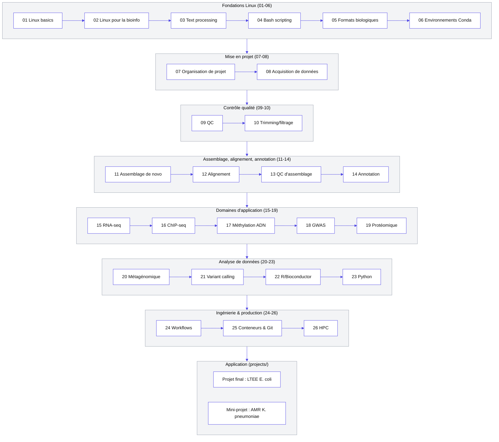

# 00 — Orientation

## Objectif de ce dépôt

Ce dépôt transforme progressivement un débutant complet en Linux en un analyste
capable de conduire une analyse bioinformatique réelle, de bout en bout, sur de
vraies données publiques, et de la rendre reproductible.

Il ne s'agit pas d'une liste de commandes à mémoriser. Chaque commande présentée
répond systématiquement aux questions suivantes :

```text
Pourquoi cette commande ?
Sur quelles données ?
Que produit-elle exactement ?
Comment vérifier qu'elle a fonctionné ?
Comment interpréter son résultat ?
Quelles sont ses limites ?
```

## Public visé

Aucun prérequis Linux n'est supposé pour commencer au module
`01_linux_basics/`. Aucun prérequis en biologie moléculaire n'est
supposé non plus pour les tout premiers modules : les notions (FASTA,
FASTQ, lecture/`read`, qualité Phred...) sont introduites au fur et à
mesure qu'elles deviennent nécessaires. Le rythme est progressif, du
débutant à l'intermédiaire, puis à l'avancé et au professionnel (voir
`docs/audit_report.md`, section « Critère de réussite »).

## Comment utiliser ce dépôt

1. Suivre les modules dans l'ordre numéroté (`01_`, `02_`, `03_`, ...) : chaque
   module s'appuie sur les précédents.
2. Exécuter réellement chaque commande présentée, sur les jeux de données
   fournis dans `linux/` pour les premiers modules, puis sur de vraies
   données publiques pour les modules avancés (téléchargement documenté
   module par module).
3. Faire les exercices avant de lire la solution.
4. Consulter systématiquement les liens de documentation officielle
   fournis pour chaque outil, sans jamais se contenter d'une commande
   copiée sans comprendre ses options.

## Où trouver quoi

| Besoin | Emplacement |
|---|---|
| Vue d'ensemble du dépôt, méthodologie, historique | `docs/audit_report.md` |
| Référence centralisée des outils (doc officielle, statut, alternatives) | `docs/tools_reference.md` |
| Jeux de données d'exercice (FASTA, FASTQ, TSV synthétiques) | `linux/` (voir `README.md` à la racine) |
| Matériau historique en cours de restructuration | `legacy/` |
| Environnements Conda documentés par domaine | `envs/` |
| Modules de cours | `01_linux_basics/` → `26_hpc/` (voir schéma ci-dessous) |
| Projet final intégrateur et mini-projets par domaine | `projects/` (voir schéma ci-dessous) |

## Feuille de route des modules

Les 26 modules ci-dessous sont tous rédigés et disponibles. Le schéma
utilise des couleurs fixées explicitement (fond clair, texte foncé),
indépendantes du thème clair/sombre du visualiseur, pour rester lisible
partout. Cliquer sur un nœud ouvre directement le README du module
correspondant. Voir `docs/audit_report.md` pour la méthodologie suivie.



**Liste équivalente** (accès direct sans diagramme, ou si votre
visualiseur ne rend pas Mermaid) :

- **Fondations Linux (01-06)** : [01](../01_linux_basics/README.md) · [02](../02_linux_for_bioinformatics/README.md) · [03](../03_text_processing/README.md) · [04](../04_bash_scripting/README.md) · [05](../05_biological_formats/README.md) · [06](../06_environment_management/README.md)
- **Mise en projet (07-08)** : [07](../07_project_organization/README.md) · [08](../08_data_acquisition/README.md)
- **Contrôle qualité (09-10)** : [09](../09_quality_control/README.md) · [10](../10_adapter_trimming_filtering/README.md)
- **Assemblage, alignement, annotation (11-14)** : [11](../11_de_novo_assembly/README.md) · [12](../12_sequence_alignment/README.md) · [13](../13_assembly_quality/README.md) · [14](../14_genome_annotation/README.md)
- **Domaines d'application (15-19)** : [15](../15_rnaseq/README.md) · [16](../16_chipseq/README.md) · [17](../17_dna_methylation/README.md) · [18](../18_gwas/README.md) · [19](../19_proteomics/README.md)
- **Analyse de données (20-23)** : [20](../20_metagenomics/README.md) · [21](../21_variant_analysis/README.md) · [22](../22_r_statistics/README.md) · [23](../23_python_bioinformatics/README.md)
- **Ingénierie & production (24-26)** : [24](../24_workflows/README.md) · [25](../25_reproducibility/README.md) · [26](../26_hpc/README.md)
- **Application réelle** : [projet final — LTEE E. coli](../projects/final_project_ltee_ecoli/README.md) · [mini-projet — AMR K. pneumoniae](../projects/mini_project_amr_kpneumoniae/README.md)

**Les 26 modules de la feuille de route sont tous rédigés, et l'étape
« application » n'est plus vide** : le projet final intégrateur
(`projects/final_project_ltee_ecoli/`) et un premier mini-projet par
domaine (`projects/mini_project_amr_kpneumoniae/`, AMR/typage/phylogénie
chez *Klebsiella pneumoniae*) sont livrés. Les mini-projets suivants
restent planifiés (voir `docs/audit_report.md` et `projects/README.md`).

## Jeu de données d'entraînement

Le dossier `linux/` contient un jeu de données synthétique conçu spécifiquement
pour ce dépôt (22 séquences génomiques, 40 transcrits, 25 protéines, 500 reads
FASTQ avec adaptateurs, 3 échantillons compressés, une table d'annotations TSV).
Il est décrit en détail dans `README.md` (racine du dépôt) avec des exercices
corrigés. Les modules `02_`, `03_` et `05_` s'appuient dessus.
